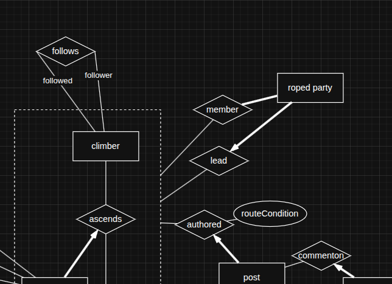
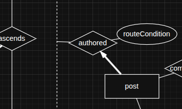

1) "friendship" self relationship should have a name for each line, as per lecture 6 p.13
2) "friendship" creation time attribute is not in the data requirements. it should be added to the data requirements or removed from the ER.
3) "friendship" is referred to as "following" in the data requirements (DR). the term should be updated in the DR or ER such that they match
4) "climber.username" is refered to as "name" in the DR, terms should be updated to match
5) A climber can be a member of more than 1 roped party. The arrow between `[climber] -> <member>` prevents that. The DR explicitely states "A climber may change roped-party between climbs." Although it is true that "a climber cannot be in more than 1 roped party at the same time", our ER does not track the exact interval of time of the roped party (hence our ER cannot express "in two roped parties at once"). This is probably a constraint we have to write down on the side.
6) same as 5), but for `[climber] -> <leads>`
7) A "roped party" does not have a name in the DR. ER and DR should match. I disagree with adding a name attribute to roped parties. nobody names their roped parties. it's just not a thing people do... do you give a name to the evening when you go to a restaurant with friends? (this was a rethorical question)
8) Optional remark: because `[ascent]` has a 1:1 key contraint with `<ascends>`, having the `[ascent] -> <postAbout>` relationship has the same impact on the meaning of our ER as having an aggregation between `<ascend> -> <postAbout>`. I thought it would help our score to have an aggregation in there, but the current ER is not wrong either. Consider adding an aggregation to the ER.
9) Having `<author>` be a separate relationship from `<PostAbout>` allows the author not to have completed the climb. We can follow from `<PostAbout>` the climber who completed the ascent (there is always only 1 related to that ascent record, good). But nothing in your ER prevents the climber in the matching `<authors>` relationship for that post to be a different climber. The DR states "A climber can only post about an ascent if they have participated in it." Update the DR or ER such that they match.
Note that my ER has an aggregation `<ascends> -> <authored>` for that exact reason: the author of the post MUST be the climber that has completed the ascent which the post is about. I'd advise to change your ER instead of the DR, since that allows us to have an aggregation, which diversifies our ER.
10) Your ER makes no link between an ascent and a roped party, despite the DR stating: "The ascent should record which roped party, if any, participated in the climb (i.e. was the climber part of a party as they made the ascent.)" You should update the ER and DR such that they match. Your current ER links roped party to a post. It allows the roped party to exist without being linked to a post (diff from DR). It allow the post to mention roped parties that were not part of the ascent (diff from DR). Here is an example of how to link a roped party to an ascent, and ensure that the climbers are part of the climb: . This ensures that the member/lead relationship are tied to a specific ascent, and ensure that the climber has been on that ascent. It does not, however, ensure that all the members/lead of a roped party have been part of the *same* ascent (which is a problem). In lack of a better solution, I would mark "members/leads of a roped party must have ascended the same route" as an extra written constraint, as allowed by the assignment.
11) In your ER, an ascent can exist without being linked to a post. Why would we want to track ascents that have not been posted about? (genuine question, can I get thoughts on this? do we want to track that?) 
12) In your ER, a roped party can exist without having been posted about (so it's completely unrelated to any ascent). Why would we want to track roped parties if they have not been on ascents? a way to fix this would be to have a participation constraint `[RopedParty] == <PostOnRoute>`. (every roped party must be tagged in at least 1 post)
13) Your ER allows a post to have many comments (good). Your ER allows a comment to have many posts (bad, a comment is tied to 1 post, imo). Your ER allows a climber to author multiple comments (good). Your ER allows a comment to have been written by multiple authors (weird... at least different than DR). Please update ER and DR such that the behavior of comments match. 
14) Post title is not in the DR. Post text body is not in the DR. Please update the DR to match the ER. 
15) DR does not mention comment text body, please update DR.
16) comment.post_id should not be an attribute, comment already tracks post via the `<HasComment>` relationship.
17) comment currently has no primary key. add a primary key
18) `<PostOnRoute>` allows a post to review the conditions of multiple routes, potentially none of which are the one that was ascended (bad). This should match the DR. If we want to change the DR to allow this, it would cascade in many more ER changes; I advise not changing the DR to allow this. See how my draft ensures that at most 1 routeCondition is posted for THE route that was ascended: 
19) Your ER calls what I assume are route conditions `reported_difficulty`.
20) Your ER ties `attempt_status` to `PostOnRoute`; why is status also tied to ascent? (as, imo, it should be). how does `attempt_status` differ from `Ascent.status`? Why can a post report on the attempt status of routes that were not part of the ascent? Please fix this.
21) Your ER states that a Route can only get `PostOnRoute` once... multiple posts should be able to review the conditions of a route (once per post, re-read the "post" section of the DR).
22) DR makes no mention of route distance (could be nice). DR makes no mention of success rate (can be calculated from related ascent tables. does NOT need to be its own attribute). Please update ER and DR so they match.
23) Jatin explicitely disagreed with mountains having unique names. I like it. Deal with Jatin, but make sure ER matches DR. (currently does)
24) It should be possible for a checkpoint to be part of multiple routes (as they logically are in real life). Note that your ER allows checkpoints to be the OBJECTIVE of more than one route, but only be `PartOf` a single route... Admitedly I have not made this super clear in the DR, mb.
25) related to 24, you cannot keep checkpoint as a weak entity if you loosen the 1:1 link they have. You COULD make them a weak entity w.r.t mountain. We could also ditch the weak entity stuff since DR states "A checkpoint has a unique location. "
26) DR makes no mention of checkpoint number. I was not against having a "camp number", camps are often numbered. I've never heard of numbered checkpoints. at best they have non-unique names ("summit" is often a checkpoint, I'd argue). Fix this please. Ensure that ER and DR match.
27) I would argue that a checkpoint can possibly be part of no routes. Like a route can exist without being part of no posts imo good to track routes before anyone tries them, as is the case in real life. E.g. Ailefroide north face has been a known, feared route long before anyone tried it (in the 1800 iirc, before they started using ropes and stuff).
28) related to 24; your ER allows a feature to be part of no route (imo good), and to be part of more than 1 route (imo good). does not make sense for checkpoints to be part of exactly 1 route.... Imagine feature "random climb", part of routes A, B, ends at checkpoint C, but checkpoint C cannot be part of both A and B.... weird... please fix (25).
29) DR mentions a feature has " a non-unique name". Please update DR or ER to match.
30) DR does not mention technical feature grading system. I do like the idea and would like to keep the idea. Can you update DR to match?
31) the DR mentions: "The post includes information about the condition of features within that route (optional, if we want more entities/relationships; I was a bit short as I wrote this)". but no comments have been made about removing this, yet your ER does not allow this. Please take a stance on the DR if you want to remove this potential design decision.

