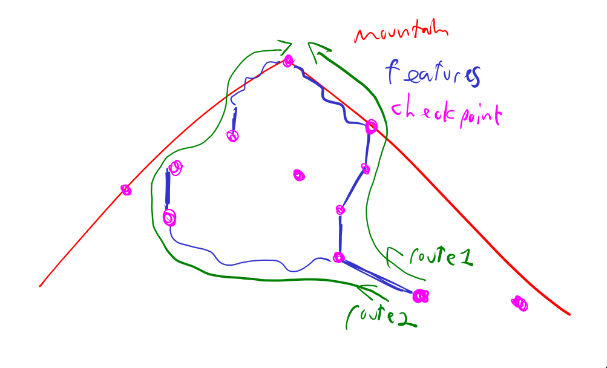

# requirements brainstorm
Most of what I (julien) have in mind, so we can start on the same page. These should not be taken as ready-to-submit as there's probably too much info and not well formated, but they should allow agreeing on what we want to keep

## the application
Think strava but for mountaineering/climbing.
Climbers want to be able to share the details of their adventures with others.
Climbers also want to be able to browse other people's climbs for information on conditions, difficulty, experience, and details of the route. 

My notes include info about why certain features are included. This info should not be transfered to the reqs we submit (e.g. "having entity A, B, C because we want an ISA")

* A climber is a generic user of the app. They ascend mountains, sometimes as part of a roped party, post about their climbs.
  * a climber can follow other climbers on the app to be notified of their new climbs
  * a climber is uniquely identified by their email
  * they have a name, address, age, nationality

* a roped party is a combination of two or more climbers (typically at most 6, but nothing prevents more people) that connect themselves via an alpine rope. This is typically done for any travels across exposed terrain that requires protection (e.g. in case someone falls in a crevace) or assistance (e.g. rock climbing).
  * a roped party has at mot 1 lead. The lead is the first on the rope, and assumes heightened responsibilities, both technical ones (has to perform some special techniques, like installing snow anchors) and those related to a heightened exposure to terrain risks (typically the first to fall through crevaces...).
  * A climber may change roped-party between climbs.
  * if it helps to make the ER model, a climber may change roped-party within a climb (e.g. feature A with party 1, feature B with party 2).
  * A climber may perform an ascent without being in a roped party

* mountain: an elevated region of terrain to climb. 
  * climbers want to be able to search the routes by mountain, as a single mountain may have multiple ways to be climbed (routes). 
  * a mountain  has a unique name

* checkpoint: a unique geographical point of interest; what the climbers try to reach, or pass by during their climbs. These are not necessarily the summit. Examples include the parking lot, base camp, camps number 1-n, the summit, the "lake of the clouds", the "midway cascade", etc.

* feature: a traversable segment of terrain (not a point; a line on a map) that possesses distinct characteristics, such that users benefit from specific information about this stretch of terrain. Examples include "5km glacier travel", users might want to know snow conditions, strength of the ice bridges, new crevaces;  "300m serac scramble", for cliff exposure, dislodged rocks; "700m alpine ridge" for presence of a cornice, depth of snow cover, wind speed and direction.
  * not every segment of the mountain is a feature. users might not need special information on a 3km flat gravel road. Features are parts of the mountain that require special care to traverse.
  *  Some features require additional technique and care to traverse. Unlike the above (glacier travel, ridge crossing), where technique is only necessary to prevent injury and not to advance, it is difficult or impossible to advance on technical terrain without proper technique. I can run across a glacier and possibly not fall into a crevace, I can't scale an ice waterfall without being roped up. 
     *  Technical features are a special category of features since they carry additional information; their difficulty is typically graded by official organizations. (see all the grades: https://en.wikipedia.org/wiki/Grade_(climbing)) 
  *  note to self: currently imo a non-covering ISA of "feature" (regular) and "technical feat." (child). could be a covering ISA with "easy peasy" (like a road), "medium" (ungraded, requires protection like glacier travel), "technical" (the current bullet point)

* a route: a sequential combination of checkpoints and features. 
  * a route has exactly one objective: one of the checkpoints. e.g. a route may go from parking lot, and end at the "lake of the cloud". note that a "checkpoint" can be the objective in one route, but not the objective in another. E.g. another route may pass by the lake of the cloud to get to the summit. The summit is the objective here, not the lake. 
  * A route happens on a mountain. could be multiple mountains? (e.g. traverse) but at least one mountain.

* an ascent is a successful completion of a route by a climber. 
  * an ascent is completed on a specific day, at a specific time.
  * it has a duration
  * a climber may ascend a route more than once
  * The ascent should record which roped party, if any, participated in the climb (i.e. was the climber part of a party as they made the ascent.)

* post: a climber that completes an ascent can post about their experience to comment on conditions of the features. 
  * a post can have as many attributes as you need to describe it, see https://www.mountainproject.com/route/105748657/the-yellow-spur for inspiration
  * a post can have pictures of the ascent (optional)
  * the conditions of the features can change over time.
  * a climber can only post about an ascent if they have completed it.
  * The post includes information about the condition of the route ascended.
  * The post includes information about the condition of features within that route (optional, if we want more entities/relationships; I was a bit short as I wrote this)
  * As it is important for climbers to keep track of the evolution of conditions, the past conditions of a route / features must be preserved. (this sounds trivial if the conditions are tied to the post or their own entity, not an attribute of the route / feature)
  * Other climbers can comment on the post. Previous comments should be preserved. (optional, removing this removes entities if we need space, does not break anything)

### 

### note to self
just brainstorm stuff

key constraint: route has at least one feature

participation constraint: every cordee must have at least one member

bold arrow: a post must have exactly one author

isa: feature can be technical feature, where it has an official grade

weak rel: checkpoint name -> mountain id

bin rel: climber membertOf roped party

tertiary rel: unsure for now

aggregation: climber climbs route. aggregation climb -> \<authors\> -> post
  the author of a post must have completed the route during a climb